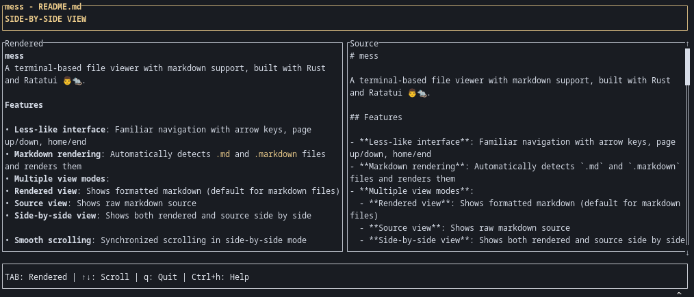

# mess

A terminal-based file viewer with markdown support, built with Rust and Ratatui 👨‍🍳🐀.



## Features

- **Less-like interface**: Familiar navigation with arrow keys, page up/down, home/end
- **Markdown rendering**: Automatically detects `.md` and `.markdown` files and renders them
- **Multiple view modes**: 
  - **Rendered view**: Shows formatted markdown (default for markdown files)
  - **Source view**: Shows raw markdown source
  - **Side-by-side view**: Shows both rendered and source side by side
- **Smooth scrolling**: Synchronized scrolling in side-by-side mode
- **Help system**: Built-in help with Ctrl+h

## Installation

```bash
cargo build --release
```

## Usage

```bash
# View a markdown file (starts in rendered mode)
./target/release/mess example.md

# View any text file (starts in source mode)
./target/release/mess README.txt
```

## Keyboard Shortcuts

### Navigation
- `↑/↓`: Scroll up/down one line
- `Page Up/Page Down`: Scroll up/down 10 lines
- `Home`: Go to beginning of file
- `End`: Go to end of file

### View Modes (markdown files only)
- `TAB`: Cycle through view modes (Rendered → Source → Side-by-side → Rendered)

### General
- `q` or `Esc`: Quit application
- `Ctrl+h`: Show help

## View Modes

### Rendered View
Shows markdown files with basic formatting applied:
- Headers (`#`, `##`, `###`)
- Bold (`**text**`) and italic (`*text*`)
- Lists (`-`, `*`, `1.`)
- Code blocks (```)
- Blockquotes (`>`)

### Source View
Shows the raw markdown source code.

### Side-by-Side View
Shows rendered markdown on the left (50 characters wide) and source on the right, with synchronized scrolling.

## Examples

The repository includes an `example.md` file that demonstrates various markdown features. Try viewing it with:

```bash
cargo run -- example.md
```

Then use TAB to cycle through the different view modes and see how the same content is displayed differently.

## License

Copyright (c) Sebastian Korotkiewicz <skorotkiewicz@gmail.com>

This project is licensed under the MIT license ([LICENSE] or <http://opensource.org/licenses/MIT>)

[LICENSE]: ./LICENSE